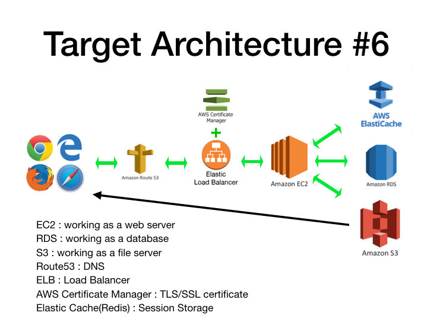
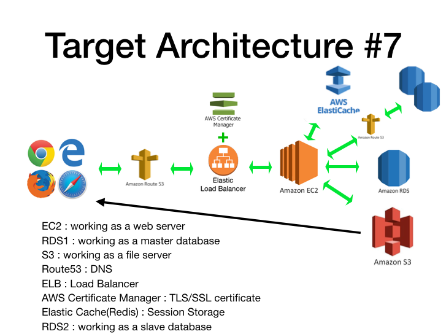

# AWS Services
- EC2
- RDS
- S3
- Route53
- ELB
- AWS Certificate Manager
- Elasticache
# How To Run
```
sh start.sh <RDS_ENDPOINT> <ACCESS_KEY> <SECRET_KEY> <S3_REGION> <DOMAIN> <REDIS_ENDPOINT>
```
# User Data(for architecture#7)

```
#!/bin/bash
cd /home/ubuntu
git clone https://github.com/MuchasEstrellas/AWS.git
cd /home/ubuntu/AWS/architecture6_7
sh start.sh <RDS_ENDPOINT>  <ACCESS_KEY> <SECRET_KEY> <S3_REGION> <REDIS_ENDPOINT>
```

# Architecture


