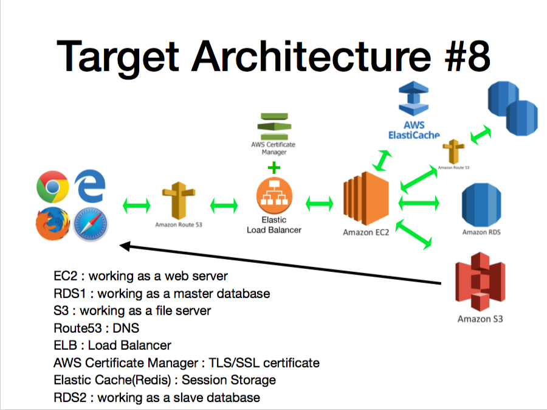

# AWS Services
- EC2
- RDSx3
- S3
- Route53
- ELB
- AWS Certificate Manager
- Elasticache
# How To Run
```
sh start.sh <RDS_ENDPOINT> <ACCESS_KEY> <SECRET_KEY> <S3_REGION> <DOMAIN> <REDIS_ENDPOINT> <READ_RDS_ENDPOINT>
```

# Architecture

